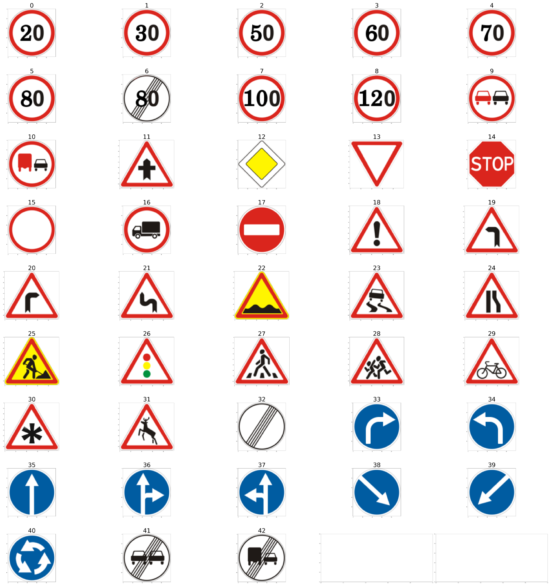

# Traffic Sign Classification and Model Pruning
Demonstrating the use of multiple pruning methods on a traffic sign classification model for model compression.

## Dependencies 
1. thop : PyTorch OpCounter
2. pytorch 

## Types of Pruning 
1. Structured  
2. Unstructured

## Dataset 
The German Traffic Sign Recognition Benchmark was used for this classification task. A list of images from the dataset is shown below 

